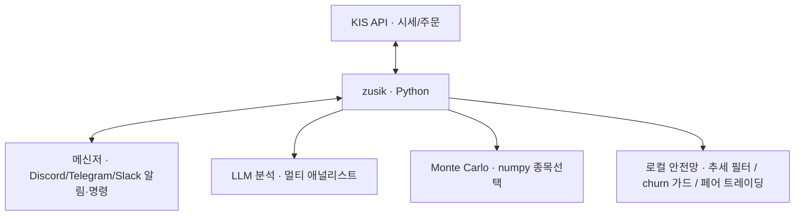

# zusik

> **한국·미국 주식과 코인을 24시간 자동매매하는 봇.** AI가 분석하고, 봇이 사고팔고, 실거래 결과로 스스로 학습합니다.

[](https://github.com/zusik-py/zusik/actions/workflows/ci.yml)
[](https://www.python.org/)
[](LICENSE)

증권사 OpenAPI 에 연결해 돌리는 완성형 매매 봇입니다. **파이썬을 몰라도 `./setup.sh` 한 줄**로 설치·키 입력·설정이 끝납니다.

- **AI 애널리스트 4명이 종목을 토론** — 펀더멘털·센티멘트·퀀트·종합 관점이 성과 가중 투표로 합의
- **안전망은 AI 없이 즉시 작동** — 급락 감지·트레일링·본전 보호·주문 검증을 추가 비용 0 으로 로컬에서
- **실거래로 스스로 보정** — 다년 일봉 walk-forward 백테스트로 청산 파라미터를 데이터 기반 조정
- **증권사 2곳 라이브 검증** — 한국투자증권·토스증권, 국내+미국 모두 (`BROKER` 로 선택)
- **원하는 시장만** — 한국만 / 미국만 / 코인만 자유롭게 (`kr_enabled`·`us_enabled` 토글)
- **알림·원격명령** — Discord·Telegram·Slack 으로 폰에서 상태 확인과 매수/매도

> 처음이라면 **모의투자(`KIS_VIRTUAL=true`)** 로 시작하세요. 실거래 손실 위험은 전적으로 본인 책임입니다([면책](#면책-disclaimer)).

---

## Git이 처음이신가요?

몰라도 괜찮습니다. Git은 코드를 내려받고 최신 상태로 업데이트하는 도구일 뿐이고, 이 봇을
쓰는 데 깊이 알 필요는 없습니다. 코드를 받는 방법은 두 가지가 있고, 어느 쪽이든 됩니다.

- **가장 쉬운 방법 (Git 없이)**: 이 페이지 위쪽의 초록색 **`Code`** 버튼을 누른 뒤
  **Download ZIP** 을 고르면 전체 코드가 압축 파일로 내려받아집니다. 압축을 풀면 준비 끝입니다.
- **업데이트가 편한 방법 (Git 사용)**: Git을 설치한 뒤 아래 한 줄을 실행합니다. 나중에 새
  버전이 나오면 같은 폴더에서 `git pull` 한 번으로 최신 코드로 갱신됩니다.

  ```bash
  git clone https://github.com/zusik-py/zusik.git
  ```

둘 중 무엇을 골라도 그다음은 똑같습니다. 받은 폴더에서 `./setup.sh` 를 실행하면 설치와 설정을
마법사가 차례로 안내합니다. 윈도우를 쓴다면 먼저 아래 [윈도우 사용자라면 (WSL 설치)](#윈도우-사용자라면-wsl-설치)
로 리눅스 환경을 준비하세요. 전체 과정은 [빠른 시작](#빠른-시작-초보자용)과
[docs/SETUP.md](docs/SETUP.md) 에 정리돼 있습니다.

---

## 윈도우 사용자라면 (WSL 설치)

WSL(Windows Subsystem for Linux)은 윈도우 안에서 리눅스를 그대로 쓰게 해주는 윈도우 기본
기능입니다. 이 봇은 리눅스에서 가장 잘 돌아가므로, 윈도우라면 WSL을 먼저 켜는 것을 권합니다.
맥이나 리눅스를 쓴다면 이 부분은 건너뛰어도 됩니다. 설치는 명령 한 줄이면 끝납니다.

1. 시작 메뉴에서 **PowerShell** 을 찾아 마우스 오른쪽 버튼으로 누르고 **관리자 권한으로 실행**
   을 고릅니다.
2. 아래를 입력하고 엔터를 누릅니다. 우분투(Ubuntu) 리눅스가 자동으로 깔립니다.

   ```powershell
   wsl --install
   ```

3. 설치가 끝나면 컴퓨터를 한 번 재시작합니다. 다시 켜지면 우분투 창이 떠서 사용할 이름과
   비밀번호를 정하라고 합니다. (비밀번호는 입력해도 화면에 안 보이는 게 정상입니다.)

이제 그 우분투 창이 곧 리눅스 터미널입니다. 앞으로 나오는 명령은 모두 이 창에서 실행하면
되고, 위 [Git이 처음이신가요?](#git이-처음이신가요)부터 그대로 이어서 진행하면 됩니다.
처음 쓰는 윈도우 화면이라면 [마이크로소프트 공식 안내](https://learn.microsoft.com/ko-kr/windows/wsl/install)
도 그림과 함께 참고할 수 있습니다.

---

## 면책 (Disclaimer)

**이 소프트웨어는 교육과 연구 목적으로 공개됩니다. 실거래에 사용하면 모든 금전적 손실
위험은 전적으로 사용자 본인에게 있습니다.**

- 투자 자문이 아니며, 수익을 보장하지 않습니다.
- 자동매매는 버그, 네트워크 장애, 시장 급변으로 **큰 손실**을 낼 수 있습니다.
- 반드시 **모의투자(`KIS_VIRTUAL=true`)** 로 충분히 검증한 뒤, 잃어도 되는 소액으로 시작하세요.
- 저자와 기여자는 본 소프트웨어 사용으로 생긴 어떠한 손해에도 책임지지 않습니다 (MIT, 무보증).

---

## 아키텍처



## 핵심 기능

- **AI 멀티 애널리스트**: 펀더멘털, 센티멘트, 퀀트, 종합 관점의 LLM 분석을 성과 가중 투표로 종합
- **선택형 종목 스크리닝**: `screening.method` 로 Monte Carlo(numpy 부트스트랩), 모멘텀, 추세, 저변동 중에서 고름
- **상황 적응 선별**: RS 상대강도 게이트에 레짐 틸트(하락장=저변동 방어주 / 상승장=모멘텀),
  최근 매도 로테이션, 이벤트 섹터 부스트(뉴스 감지 시 수혜 섹터 종목 우선) 적용
- **다층 안전망**: LLM 호출 없이 즉시 작동하는 추세 필터, 급락 감지, 트레일링, 본전 보호, churn 가드.
  실시간/40초 익절도 지원(WebSocket 틱 + 빠른 익절 서브루프)
- **자가 보정 학습**: 다년 일봉 walk-forward 백테스트로 청산 파라미터를 데이터 기반으로 보정
- **인버스 ETF 헷지·수익화**: 지속적 위기에서만 발동해 단발 급락 휩쏘를 피한다. 기초지수가
  실제로 빠질 때만 사고(시장별 무차별 매수 차단), 순익 +1.5% 면 바로 익절해 작은 수익을 챙긴다 (`inverse.*`)
- **멀티 마켓**: 한국·미국 주식과 업비트 암호화폐를 각 시장 시간에 맞춰 운용. 시장별로 끌 수 있다(`us_enabled` / `kr_enabled`)
- **멀티 메신저 양방향**: Discord, Telegram, Slack 동시 알림과 명령 원격 제어 지원 (백엔드 교체식)
- **AI 사용량 최적화**: claude/codex/agy(Antigravity) 멀티 CLI 분산, provider 실패 자동 cooldown,
  요금제·개수에 맞춘 일일 한도 자동 설정(`setup.sh` 마법사), 웹검색/캐시 조절. CLI 가 없어도 로컬
  퀀트 전략만으로 매매
- **운영 안정성**: 코어 죽음/멈춤(hang) 워치독(systemd timer + OnFailure 즉시 알림), LLM 전체 다운
  알림, 진단 명령(`/헬스`, `/점검`)으로 provider별 실시간 상태 확인

## 지원 브로커

`.env` 의 `BROKER` 값으로 어느 증권사 Open API 를 쓸지 고릅니다(활성 1개). 두 증권사 키를
`.env` 에 함께 넣어둘 수 있고(`KIS_*`, `TOSS_*`), `BROKER` 값만 바꾸면 키를 다시 입력하지 않고 바로
전환됩니다. 브로커별 키가 비어 있으면 `KIS_*` 로 폴백하므로 한 곳만 쓰면 `KIS_*` 만 채워도 됩니다.
진짜로 둘을 동시에 굴리려면 `BROKER` 가 다른 봇 인스턴스를 따로 실행하세요(계좌·상태 분리).
지원 브로커는 한국투자증권(KIS)과 토스증권 두 곳이며 둘 다 라이브 검증됐습니다.

| `BROKER` | 증권사 | 상태 | 시장 | 포털 |
|---|---|---|---|---|
| `kis` (기본) | 한국투자증권 | **지원 (검증)** | 국내 + 미국 | [apiportal.koreainvestment.com](https://apiportal.koreainvestment.com) |
| `toss` | 토스증권 | **지원 (라이브 검증)** | 국내 + 미국 | [developers.tossinvest.com](https://developers.tossinvest.com/docs) |

- 토스증권은 공식 Open API(OAuth 2.0)로 구현·**라이브 검증**됐습니다(`zusik/clients/toss_client.py`). 다만 토스는 모의 샌드박스가 없어, **주문은 기본 dry-run**(전송 없이 보낼 내용만 로깅)이며 `TOSS_LIVE_ORDERS=true` 일 때만 실제 주문이 나갑니다(KIS의 모의투자에 해당하는 안전장치). 국내와 미국 주식을 모두 지원합니다(같은 엔드포인트, 미국은 ticker + USD). 호가창만 미지원입니다.

**토스증권으로 쓰려면**: 토스 Open API 키를 발급받아 `.env` 에 `BROKER=toss`,
`TOSS_CLIENT_ID=...`, `TOSS_CLIENT_SECRET=...` 를 넣습니다.
토스는 **client_id/secret 두 개만 필요**하고, 계좌는 API 로 자동 탐색합니다(계좌번호 입력 불필요). 먼저
`python3 main.py --status` 로 시세와 잔고가 제대로 보이는지 확인하고(주문은 dry-run), 충분히
검증한 뒤에만 `TOSS_LIVE_ORDERS=true` 로 실제 주문을 켜세요(국내·미국 모두 가능, 미국은 USD 잔고 필요).
새 증권사 연동이나 토스 미국장 보강 기여는 [CONTRIBUTING.md](CONTRIBUTING.md) 환영합니다.

## 빠른 시작 (초보자용)

파이썬을 몰라도 됩니다. `setup.sh` 가 설치, 키 입력, 권한 설정까지 알아서 처리합니다.

**준비물 3가지**
1. **증권사 계좌 + 앱 키**: [한국투자증권 OpenAPI](https://apiportal.koreainvestment.com) 에서 무료 발급 (모의투자 지원).
   **토스증권**([developers.tossinvest.com](https://developers.tossinvest.com/docs))도 됩니다 — `.env` 에 `BROKER=toss` 와 토스 키를 넣으면 됩니다(국내·미국 모두 지원). 자세한 건 [지원 브로커](#지원-브로커) 참고
2. **항상 켜둘 컴퓨터**: 24/7 매매라 꺼지면 멈춥니다 (PC, 서버, Mac mini, Windows **WSL** 모두 가능)
3. (선택) **Discord**: 폰으로 매매 알림 받고 원격 명령

> **특정 시장만 하고 싶다면**: 미국을 안 하면 `kr`/암호화폐만, 한국을 안 하면 `us`/암호화폐만 돌릴 수
> 있습니다. `./setup.sh --config` 마법사가 물어보며, 직접 끄려면
> `python3 scripts/configtool.py set us_enabled false` (미국 끄기) 또는
> `python3 scripts/configtool.py set kr_enabled false` (한국 끄기) 를 실행하세요.

```bash
# 1) 설치: uv 로 .venv 생성 + 의존성 + 테스트 검증을 한 번에 (OS 자동 감지)
./setup.sh
#    마법사가 '간단 / 자세히' 를 물어봅니다. 처음이면 '간단' 선택 후 KIS 키만 붙여넣으면 끝.
#    .env 파일 편집(vim)·권한(chmod)은 자동으로 처리되니 직접 만질 필요 없습니다.
source .venv/bin/activate

# 2) 셋업 점검: KIS/AI/메신저가 실제로 연결되는지 확인 (시크릿 값은 출력 안 함)
python3 main.py --healthcheck

# 3) 실행
python3 main.py --status     # 포트폴리오 상태 확인
python3 main.py --once       # 1회만 실행해 보기
python3 main.py              # 24/7 자동 매매 시작
```

> **처음이라면 반드시 모의투자부터**: `.env` 의 `KIS_VIRTUAL=true`(가짜 돈)로 며칠 돌려 동작을
> 확인한 뒤 실거래로 전환하세요 (상단 [면책](#면책-disclaimer) 참고). 키와 설정을 바꿀 때는 파일을
> 열 필요 없이 `./setup.sh --config` 를 다시 실행하면 됩니다.

- **24/7 상시 가동** (systemd / macOS launchd / WSL 주의점): API 발급 상세는 **[docs/SETUP.md](docs/SETUP.md)** 참고
- **`--healthcheck`** 는 셋업 직후와 장 시작 전에 권장합니다. `--notify` 를 붙이면 결과를 메신저로도 보내
  장전 cron 으로 "오늘 AI/API 정상?" 자동 점검이 가능합니다. 자세한 내용은 **[docs/TESTING.md](docs/TESTING.md)** 참고

## 문서

| 문서 | 내용 |
|------|------|
| [docs/SETUP.md](docs/SETUP.md) | 설치, KIS API 발급, Discord 봇, systemd 서비스 등록 |
| [docs/CONFIGURATION.md](docs/CONFIGURATION.md) | `config.yaml` 설정 항목 레퍼런스 |
| [docs/ARCHITECTURE.md](docs/ARCHITECTURE.md) | 매매 루프, 전략, 안전망, 자가학습 동작 구조 |
| [docs/LLM.md](docs/LLM.md) | LLM 분석 출력 계약(provider 공통)과 confidence→투자 가중치 하네스 |
| [docs/TESTING.md](docs/TESTING.md) | 테스트 실행, 구성, 회귀 추가법 + 헬스체크(`--healthcheck`) |
| [docs/LOCAL_LLM.md](docs/LOCAL_LLM.md) | API 비용/쿼터 없이 로컬 LLM(Ollama) + 웹검색으로 분석 돌리기 |
| [docs/LOGS_AND_REPORTS.md](docs/LOGS_AND_REPORTS.md) | 로그, 상태, 리포트 저장/보고 위치 + 월간 HTML 요약 |
| [SECURITY.md](SECURITY.md) | 보안 정책: 취약점 신고 절차, 적용된 방어 체계 |

## 모듈 구조

```
main.py            # 진입점 (.env 로드 + 봇 시작, systemd ExecStart)
security_lock.py   # 코드 무결성 트립와이어 (시작 시 main.py 가 검증)
config.yaml        # 매매 파라미터 (시크릿 아님)
setup.sh           # 환경 세팅 한 줄 (uv)

zusik/             # 패키지
├─ core/           # 매매 두뇌
│   ├─ bot.py            # TradingBot 오케스트레이션 (생성 · tick · run_once · 전략전환)
│   ├─ bot_*.py          # 관심사별 mixin (kr · us · inverse · fastlane · risk · sizing · selection ...)
│   └─ risk · position · reward · trading_mode · resilience ...
├─ clients/        # 외부 연동 (KIS · 메신저 · Upbit · LLM CLI 라우팅)
├─ analysis/       # 신호·분석 (멀티 애널리스트 · 지표 · 백테스트 · 섹터/이벤트)
├─ storage/        # 영속화 (매매기록 · 실현손익 · equity curve)
├─ strategies/     # 전략 (auto_hybrid · adaptive · momentum_breakout ...)
└─ utils/          # 공통 유틸 (로깅 등)

tests/             # 테스트 (test_bot.py 게이트 + 애널리스트/코덱스 단위테스트)
scripts/           # 운영 도구 (configtool · calibrate · verify_profit · cmd · watchdog ...)
deploy/            # 배포 (zusik.service · setup_service.sh)
docs/              # 문서 (SETUP · CONFIGURATION · ARCHITECTURE)

data/              # 자동 생성 (.gitignore): 매매기록/포지션/학습 상태
```

동작 구조는 [docs/ARCHITECTURE.md](docs/ARCHITECTURE.md) 를 참고하세요.

## 테스트

```bash
python3 tests/test_bot.py          # 통합 테스트 게이트 (네트워크 불필요, systemd ExecStartPre 와 동일)
python3 main.py --healthcheck      # 실제 KIS/AI 연결 점검 (셋업 후와 장 시작 전)
```

테스트는 가짜 시세/계좌로 **코드 로직**을 보고, 헬스체크는 **실제 연결**을 봅니다. 구성, 회귀 추가법,
cron 자동 점검은 **[docs/TESTING.md](docs/TESTING.md)** 를 참고하세요.

모든 push/PR 에서 [GitHub Actions CI](.github/workflows/ci.yml)로 자동 실행되며,
서비스는 재시작할 때 이 테스트를 먼저 통과해야 기동됩니다.

## 보안

실거래 봇이라 보안을 최우선으로 다룹니다. 취약점은 **공개 이슈로 올리지 말고** 비공개로
신고해 주세요. 신고 절차와 적용된 방어 체계(주문 관문, 무결성 트립와이어, 해시 핀, CI 스캔,
Dependabot)는 **[SECURITY.md](SECURITY.md)** 를 참고하세요.

## 기여하기 (개발자용)

이슈, PR 환영합니다. 개발 환경, PR 절차는 **[CONTRIBUTING.md](CONTRIBUTING.md)**, 동작 구조는
**[docs/ARCHITECTURE.md](docs/ARCHITECTURE.md)** 를 보세요. 아래는 코드에 손대기 전 빠른 지도입니다.

**코드 읽기 시작점**
1. `main.py`: 진입점 (.env 로드 후 `KISClient`, 메신저, `TradingBot` 생성)
2. `zusik/core/bot.py`: `tick()`(1분: 명령, 알림, 재선별), `run_once()`(2분: `run_kr`/`run_us`/`run_crypto`)
3. `zusik/core/bot_*.py`: 관심사별 mixin (kr, us, inverse, sizing, risk, selection, reporting …)
4. `zusik/strategies/`, `zusik/analysis/`: 전략 분기, 신호, 멀티 애널리스트, 백테스트

**반드시 지킬 불변식** (PR 리뷰 기준)
- **손실-행동 회귀 테스트**: 손실로 이어지던 행동을 고치면 `LossPatternRegressionTests` 에
  "되돌리면 깨지는" 가드를 함께 추가합니다. 계약 테스트가 아니라 "전략이 손실 방식대로 행동 안 하는가" 를 검증합니다.
- **fail-closed**: 주문 관문(`OrderSafetyValidator`)과 안전장치는 의심스러우면 거부/축소합니다. 위험을 늘리는 경로는 fail-closed.
- **의사결정은 effective 지표**: 손익과 드로우다운 판단은 결제(T+2)에 흔들리는 raw 가 아니라 effective 값을 씁니다.
- **Python 3.8 호환**: 모든 파일 상단에 `from __future__ import annotations`. 3.9+ 전용 문법은 금지합니다.
- **테스트 게이트 필수**: `python3 tests/test_bot.py` 를 통과해야 PR, 서비스 기동이 됩니다 (systemd `ExecStartPre`).
- **시크릿 커밋 금지**: `.env` 와 토큰은 절대 커밋하지 않습니다.

**흔한 작업 레시피**
- 전략 추가: `zusik/strategies/` 에 모듈 작성 → `bot.py:_build_strategy()` 에 등록 (kwargs 자동 필터) → 백테스트로 검증
- 회귀 테스트 추가: `tests/test_bot.py` 의 알맞은 클래스에 `test_...` 추가 후 suite 등록 (방법: **[docs/TESTING.md](docs/TESTING.md)**)
- 설정 키 추가: `config.yaml` 에 키를 추가하고 로더에 반영. 운영 값 변경은 파일 직접 편집 대신 `scripts/configtool.py` 사용

**개발/검증 도구**

```bash
python3 tests/test_bot.py                         # 통합 테스트 게이트 (네트워크 불필요)
python3 main.py --healthcheck                     # 실제 KIS/AI 연결 점검
python3 scripts/calibrate_from_history.py         # 다년 일봉 walk-forward 청산 파라미터 보정
python3 scripts/verify_profit.py                  # 실거래 수익 설계 검증
python3 scripts/backtest_profit_mechanisms.py     # 수익 메커니즘 백테스트
```

변경 시 테스트 게이트 통과와 Python 3.8 호환을 유지해 주세요. 행동 강령은
[CODE_OF_CONDUCT.md](CODE_OF_CONDUCT.md), 변경 이력은 [CHANGELOG.md](CHANGELOG.md) 를 참고하세요.

## 라이선스

[MIT](LICENSE). 무보증. 실거래 사용에 따른 손실은 사용자 책임입니다(상단 면책 참고).
