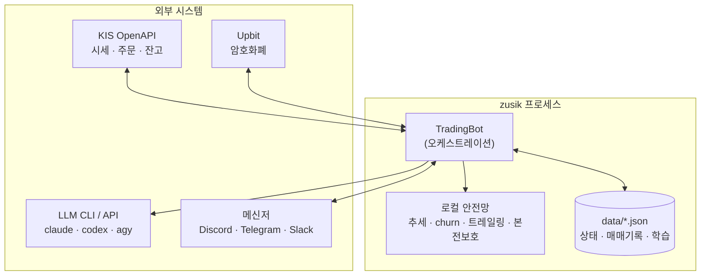
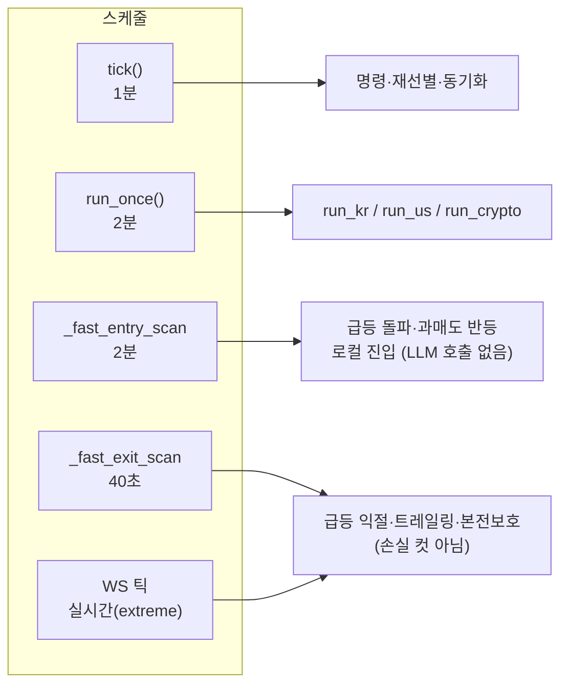
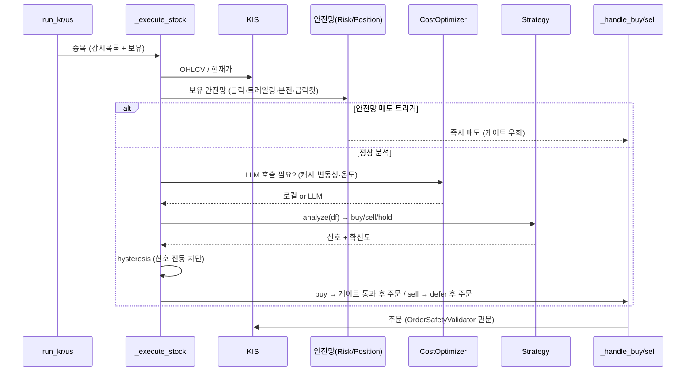
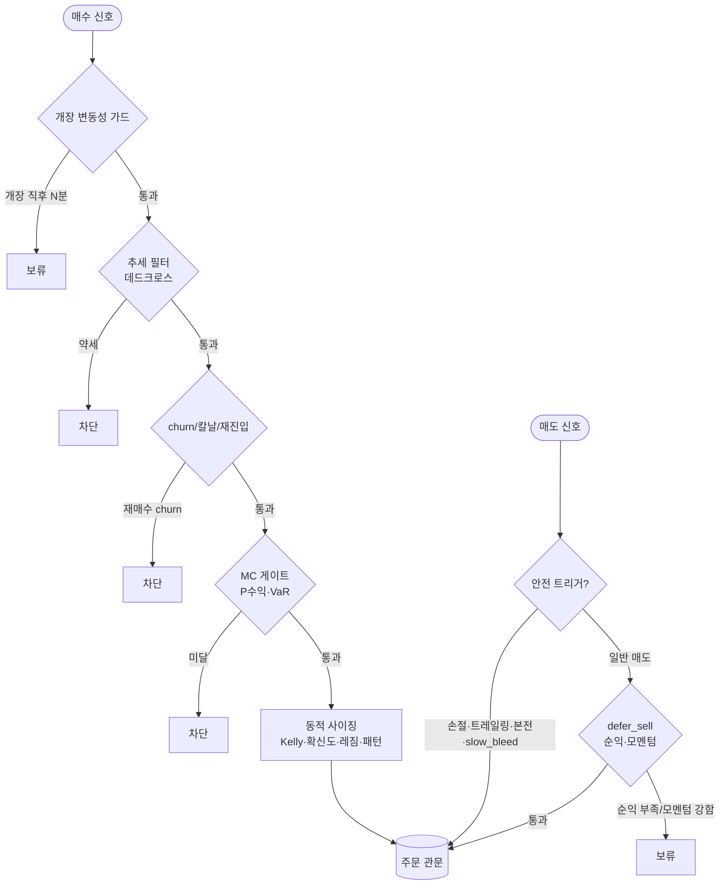
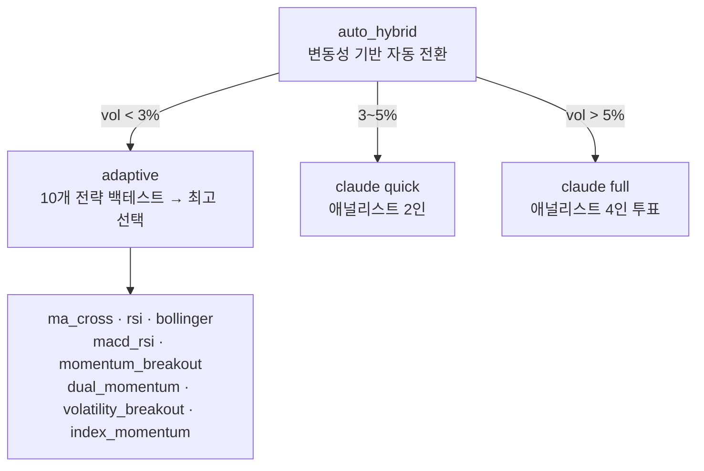
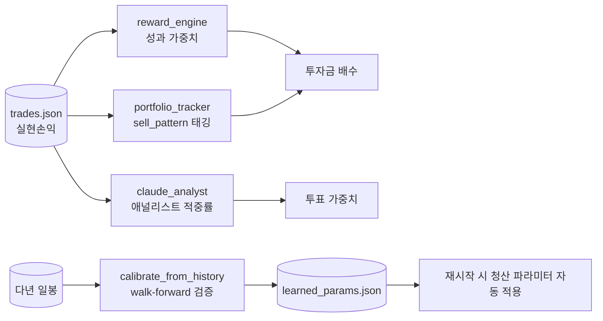
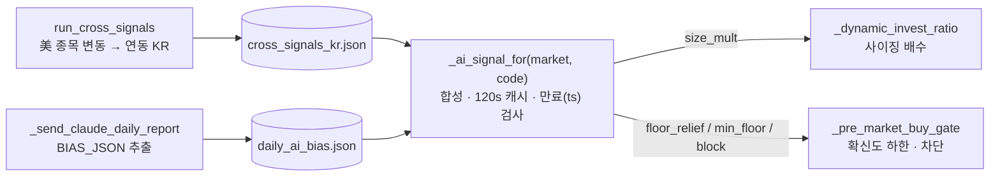
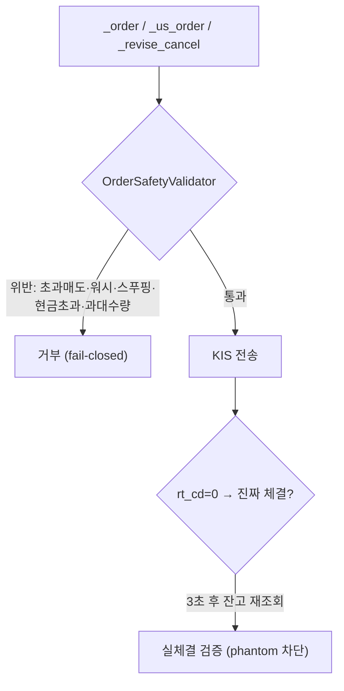

# 아키텍처 가이드

zusik 의 내부 구조를 한눈에 보는 문서입니다. 패키지 레이아웃, `TradingBot` 의 관심사별
분해(mixin), 실행 루프 타이밍, 매매 흐름, 안전망, 자가학습을 다이어그램으로 정리합니다.

GitHub 은 ```mermaid``` 코드블록을 다이어그램으로 렌더링합니다.

---

## 1. 시스템 컨텍스트



- 외부 매매와 시세는 KIS / Upbit, 의사결정 보조는 LLM, 알림과 원격명령은 메신저.
- LLM 이 죽어도 로컬 안전망만으로 보유 보호와 청산이 동작합니다(비용 $0, 즉시).

---

## 2. 패키지 구조

```
main.py                  # .env 로드 → MultiNotifier + TradingBot → 루프 시작 (systemd ExecStart)
security_lock.py         # 코드 무결성 트립와이어 (시작 시 검증)

zusik/
├─ core/                 # 매매 두뇌
│   ├─ bot.py            # TradingBot — 오케스트레이션(__init__ · tick · run_once · 전략전환)
│   ├─ bot_kr.py         # KRTradingMixin     — 한국 매수/매도/사이클
│   ├─ bot_us.py         # USTradingMixin     — 미국 매수/매도/사이클/로테이션
│   ├─ bot_inverse.py    # InverseHedgeMixin  — 인버스 ETF 헷지 진입/청산/레짐
│   ├─ bot_fastlane.py   # FastLaneMixin      — 개장가드 · 빠른 진입 · 빠른 익절
│   ├─ bot_reporting.py  # ReportingMixin     — 장전/장후/패턴/월간 리포트
│   ├─ bot_risk.py       # RiskExitMixin      — churn/칼날/재진입 · 위기 · 청산 게이트
│   ├─ bot_sizing.py     # SizingModeMixin    — 동적 사이징 · Kelly · 모드 · 합의배수
│   ├─ bot_selection.py  # SelectionMixin     — 종목 선별/스크리닝/RS/로테이션/이벤트
│   ├─ bot_aux.py        # AuxMarketsMixin    — 암호화폐 · 페어 · 크로스시그널 · 아레나
│   ├─ bot_helpers.py    # CoreHelpersMixin   — MC/지표/whitelist/equity 등 공용 헬퍼
│   ├─ risk_manager.py · position_manager.py · trading_mode.py
│   ├─ reward_engine.py · performance_trainer.py · event_learner.py
│   └─ cost_optimizer.py · resilience.py · portfolio_arena.py · pair_trader.py
├─ clients/              # 외부 연동
│   ├─ kis_client.py · kis_websocket.py · crypto_client.py
│   ├─ claude_client.py  # CLI 자동탐지 + API 폴백
│   └─ discord_*.py · notifier.py  # 멀티 메신저 추상화
├─ analysis/             # 신호·분석
│   ├─ smart_signals.py · indicators.py · auto_screener.py
│   ├─ claude_analyst.py · stock_screener.py · screen_candidates.py
│   └─ backtest.py · pnl_review.py · bot_money_helpers.py
├─ storage/              # portfolio_tracker.py (매매기록 · 실현손익 · equity curve)
├─ strategies/           # base + auto_hybrid · adaptive · claude · momentum_breakout · ...
└─ paths.py              # 모든 리소스 경로의 루트 앵커
```

모든 `data/`, `config.yaml` 경로는 `zusik/paths.py` 가 해석하므로 서브패키지로 옮겨도 경로가 깨지지 않습니다.

---

## 3. TradingBot 합성: 관심사별 mixin

`TradingBot` 은 7900줄 단일 클래스였으나, 기존 행동을 그대로 유지하면서 관심사별 mixin 으로 분해했습니다.
`bot.py` 는 골격(생성, 루프, 전략전환)만 남기고, 나머지는 각 `bot_*.py` 가 담당합니다.
mixin 은 베이스 클래스이므로 `self.*` 호출과 클래스 속성이 MRO 로 그대로 해결됩니다(호출부 변경 없음).

```mermaid
classDiagram
    class TradingBot {
        __init__()  생성·의존성 조립
        tick()      매 1분
        run_once()  매 2분
        _switch_strategy()
        start() · status()
    }
    class KRTradingMixin { run_kr · _handle_buy · _handle_sell }
    class USTradingMixin { run_us · _handle_us_buy/sell · 로테이션 }
    class InverseHedgeMixin { 진입게이트 · 레짐청산 · deep_collapse }
    class FastLaneMixin { 개장가드 · fast_entry · fast_exit }
    class ReportingMixin { 장전/장후/패턴/월간 리포트 }
    class RiskExitMixin { churn · 칼날 · 위기 · defer_sell · 트레일링 }
    class SizingModeMixin { dynamic_invest · Kelly · 모드 · 합의 }
    class SelectionMixin { 선별 · 스크리닝 · RS · 이벤트 로테이션 }
    class AuxMarketsMixin { 암호화폐 · 페어 · 크로스시그널 }
    class CoreHelpersMixin { MC · 지표 · whitelist · equity }

    TradingBot --|> KRTradingMixin
    TradingBot --|> USTradingMixin
    TradingBot --|> InverseHedgeMixin
    TradingBot --|> FastLaneMixin
    TradingBot --|> ReportingMixin
    TradingBot --|> RiskExitMixin
    TradingBot --|> SizingModeMixin
    TradingBot --|> SelectionMixin
    TradingBot --|> AuxMarketsMixin
    TradingBot --|> CoreHelpersMixin
```



| Mixin | 파일 | 책임 |
|-------|------|------|
| `KRTradingMixin` | `bot_kr.py` | 한국 매수/매도, `run_kr` 사이클, 미정산 현금 계산 |
| `USTradingMixin` | `bot_us.py` | 미국 매수/매도, `run_us`, 인덱스 로테이션, 개장 준비 |
| `InverseHedgeMixin` | `bot_inverse.py` | 인버스 진입 허용 게이트, 레짐 기반 청산, deep_collapse 컷 |
| `FastLaneMixin` | `bot_fastlane.py` | 개장 변동성 가드, 빠른 로컬 진입(2분), 빠른 익절(40초) |
| `ReportingMixin` | `bot_reporting.py` | 장전/장후/EOD 패턴/월간 리포트, 오류 알림 |
| `RiskExitMixin` | `bot_risk.py` | churn, 칼날, 재진입 차단, 위기 감지, 청산 deferral, 트레일링 게이트 |
| `SizingModeMixin` | `bot_sizing.py` | 동적 투자비중, Kelly, 모드 전환, 합의/패턴 배수 |
| `SelectionMixin` | `bot_selection.py` | 종목 선별, 스크리닝, RS 상대강도, 이벤트 섹터 로테이션 |
| `AuxMarketsMixin` | `bot_aux.py` | 암호화폐, 페어 트레이딩, 크로스마켓 시그널, 아레나 |
| `CoreHelpersMixin` | `bot_helpers.py` | Monte Carlo, 지표, whitelist, equity 동기화 등 공용 |

---

## 4. 실행 루프 & 타이밍

주기가 다른 루프들이 협력합니다. 느린 AI 사이클의 사각지대는 빠른 로컬 루프가 메웁니다.



- **`tick` (1분)**: Discord 명령, 외부 매매 동기화, 장중 재선별, 페어/아레나/equity 주기 작업.
- **`run_once` (2분)**: 시장 시간에 맞춰 `run_kr`/`run_us`/`run_crypto`.
- **`_fast_entry_scan` (2분)**, **`_fast_exit_scan` (40초)**, **WS 틱**: AI 사이클 사이의 타이밍 보완.

---

## 5. 매매 흐름: `_execute_stock`



보유 종목은 감시목록에서 빠져도 항상 분석 루프에 포함됩니다(청산 누락 방지).

---

## 6. 매수/매도 게이트



- 추가매수(피라미딩)는 churn/개장 가드를 면제합니다. "되사기(churn)"와 "승자 증폭"을 구분하기 위해서입니다.
- 빠른 진입(fast_entry)은 개장가드를 우회합니다. 확인된 급등/반등은 '보류' 대신 즉시 진입합니다.
- 트레일링과 본전 보호는 수익 구간에서만 발동합니다(손실 확정 금지). 손실 차단은 hold-floor/하드스톱이 담당합니다.

---

## 7. 전략 계층



`claude_strategy` 의 4 애널리스트(펀더멘털, 센티멘트, 퀀트, 종합)는 성과 가중 투표로 종합하며,
적중률을 베이지안으로 추적해 가중치를 갱신합니다.

---

## 8. 인버스 ETF 헷지

- 진입: 시장 condition(tension/crisis/war)이거나 bear regime score 가 임계 이상이면 인버스 매수를 허용합니다.
  `config.inverse.trigger_crisis`(기본 ON) / `trigger_index_crash`(기본 OFF, 단발 급락 휩쏘 회피).
- 청산: 평시 복귀(peace + bear score 낮음) 시 강제 청산합니다. 인버스는 테일 헷지이므로 장기 보유를 금지합니다.
- 인버스 차트는 지수 상승 시 자연 하락하므로 단독 crisis/급락 판정에서 제외합니다(전체 긴급홀딩 오발 방지).

---

## 9. 수익 기반 자가학습



| 구성요소 | 역할 |
|----------|------|
| `reward_engine` | 전략, 종목, 상황별 최근 성과를 기하평균 합산 → 투자금 배수 |
| `portfolio_tracker` | 매도를 `sell_pattern` 자동 태깅 → 고승률 패턴 증폭, 저승률 억제 |
| `claude_analyst` | 애널리스트별 적중률 베이지안 추적 → 투표 가중치 |
| `performance_trainer` | 월간 공과 평가로 리스크/분산 파라미터 누적 조정 |
| `scripts/calibrate_from_history.py` | 다년 walk-forward 로 청산 파라미터 검증 및 보정(오버피팅 차단) |

청산 파라미터는 직관이 아니라 다년 walk-forward 백테스트로 정합니다. 검증을 통과한 값만
`data/learned_params.json` 에 기록하고, 재시작 시 화이트리스트 키만 안전하게 오버레이합니다.

---

## 10. 데이터 영속화 (`data/`, 자동 생성, gitignore)

| 파일 | 내용 |
|------|------|
| `trades.json` | 모든 매수/매도 + 실현손익 (KR/US 마켓 태깅) |
| `positions.json` | 활성 포지션 (분할, 트레일링 상태) |
| `risk_state.json`, `reward_state.json` | 긴급홀딩/전략전환, 전략과 종목 성과 가중치 |
| `equity_curve.json` | 일일 자산 스냅샷 + drawdown |
| `reentry_block.json`, `knife_block.json` | 재진입/칼날 차단 상태 |
| `learned_params.json` | 캘리브레이션 산출 청산 파라미터 |
| `kis_token.json`, `api_costs.json` | API 토큰 캐시, 일일 호출 추적 |

---

## 11. KIS API 특이사항 & 제약

- **거래소 코드가 시세/주문에서 다름**: 시세 `NAS/NYS/AMS`, 주문 `NASD/NYSE/AMEX` (버그 아님).
- **토큰 캐시** `data/kis_token.json` 으로 재시작 간 재발급 회피, **레이트리밋** 자가조절(2.5→18 req/s).
- **소액 계좌**: 1주 가격이 시드보다 비싼 메가캡은 매수 불가.
- **미정산 매도금**: KR T+2 / US T+1 결제 대기 금액은 매수엔 못 쓰지만 자산엔 포함(유령 손익 보정).

---

## 12. AI 신호의 매매 반영

LLM/시그널 산출물은 매수 게이트와 사이징에 실제로 반영됩니다. 다만 진입 게이트까지만 영향을 주고,
직접 매수를 트리거하지는 않습니다(오신호 폭주 방지).



- 생산: `run_cross_signals`(US 마감 후, 연동 KR 종목 편향)과 `_send_claude_daily_report`(장후
  리포트 끝 `BIAS_JSON=` 추출)가 신호를 생성합니다. 둘 다 `paths.write_json_atomic` 으로 원자적으로 기록합니다.
- 소비: `_ai_signal_for` 가 두 신호를 종목 단위로 합성해 `{size_mult, min_floor, floor_relief, block}` 을 산출합니다.
  파일 `ts` 가 `ai_signals.freshness_hours`(기본 30h)를 초과하면 무시합니다(fail-closed). 캐시는 사이클당 1회 로드.
- 반영: 강세면 확신도 하한 완화 및 증액, 약세면 하한 상향 및 축소, 매도 판단이면 신규 매수를 차단합니다.
- 토글과 만료는 `config.ai_signals.{enabled, freshness_hours}` 로 설정합니다. 데이터 없으면 전부 중립(거동 불변).

---

## 13. 자산과 결제 모델: raw vs effective

KR T+2 / US T+1 결제 때문에 "지금 보이는 현금"은 실시간으로 출렁입니다. 그래서 표시용 raw
와 의사결정용 effective 를 분리합니다.

| 지표 | 계산 | 용도 |
|------|------|------|
| raw: `total_equity` / `pnl_pct` / `drawdown_pct` | 정산 현금 + 평가액 (결제 타이밍 민감) | 로그 표시(보조) |
| effective: `effective_pnl_pct` / `effective_drawdown_pct` | 입금 대비 실현+미실현 (결제 무관) | 모든 의사결정 |

- `compute_total_equity` 는 KR 미정산 매도 대금(재사용 가능한 orderable)을 자산에 포함합니다.
  US 의 `us_pending_net` 처리와 대칭입니다. 매도 직후 `d2_cash` 가 in-transit 매도금을 누락해
  자산을 가짜로 과소표시(예: 금요일 매도 4.16M, 화요일 결제 전까지 가짜 -16.57%)하던 문제를 차단합니다.
  (매수 직후 stale `total_cash` 로 과대표시하던 버그는 양방향 가드로 함께 수정됩니다. `EquitySettlementTests` 참고.)
- 방어 모드/드로우다운 가드는 `get_effective_drawdown()` 기준, 일일 손실 한도는 실현손익 기준입니다.
  raw 유령 손익에 흔들려 매매를 잘못 멈추거나 디레이팅하는 일을 방지합니다.
- 자산 동기화 로그도 effective 를 헤드라인으로 출력합니다(raw 는 괄호 보조).

---

## 14. 주문 안전 관문 & 복원력 (`resilience.py`)

전략과 사이징 계층이 악의적으로 변형되거나 버그가 나도, 모든 주문은 단일 관문을 통과해야
나갑니다. 계좌탈취/조작 패턴을 구조적으로 차단합니다.



- `OrderSafetyValidator`: 초과/유령 매도, 워시트레이딩, 스푸핑 지정가, 현금 드레인, 인젝션
  과대수량을 거부합니다. 위반과 검증 예외 모두 fail-closed(미전송)입니다. 정정/취소도 `validate_amend` 가 같은 관문을 거칩니다.
- Phantom 주문 검증: `rt_cd=0` 은 "전송 완료"일 뿐 체결 보장이 아닙니다. KR 매수/매도 후 3초 뒤
  잔고 재조회로 실제 변화를 확인합니다(미체결이면 success=False). 폭락일 헷지 미작동 사고의 root-cause fix.
- LLM 권한 격리: agent CLI 는 거래소/메신저 시크릿을 제거한 env 로 실행하고(`_child_env`),
  claude 는 `--disallowedTools` 로 셸/파일 도구를 차단합니다. 프롬프트 인젝션을 통한 로컬 접근 경로를 제거합니다.

---

## 15. 설계 원칙 (기여자 필독)

코드를 고치기 전에 반드시 이해해야 하는 불변식입니다. 어기면 PR 리뷰/회귀 테스트에서 막힙니다.

- 데이터 기반 결정: 직관이 아니라 실거래와 백테스트가 파라미터를 정합니다. 급락 즉시컷이
  실측 0% 승률(바닥 투매)이라 억제(hold-floor)하고, 고승률 패턴(rsi_overbought 등)은 증폭합니다.
- 손실-행동 회귀 테스트: 손실로 이어지던 행동을 고치면 `LossPatternRegressionTests` 에
  "되돌리면 깨지는" 가드를 추가합니다. 계약이 아니라 행동을 검증합니다.
- fail-closed: 위험을 늘리는 경로(매수, 증액, 정정, 주문)는 의심스러우면 거부/축소합니다.
  가용성 우선 경로(리포트, 알림, 캐시)만 fail-open.
- effective 지표로 판단: 손익/드로우다운 결정은 결제 타이밍에 흔들리는 raw 가 아닌 effective 를 씁니다.
- 단일 관문: 주문은 `OrderSafetyValidator`, 매매 기록은 `record_buy/record_sell`, 경로는
  `paths.*`, 설정은 `config.local.yaml`(configtool). 우회로를 만들지 않습니다.
- Python 3.8 호환, 테스트 게이트(`tests/test_bot.py`) 통과, 시크릿 커밋 금지.

---

## 참고

- 설치/실행: [SETUP.md](SETUP.md), 설정 레퍼런스: [CONFIGURATION.md](CONFIGURATION.md)
- 테스트/헬스체크: [TESTING.md](TESTING.md), 보안: [../SECURITY.md](../SECURITY.md), 이력: [../CHANGELOG.md](../CHANGELOG.md)
